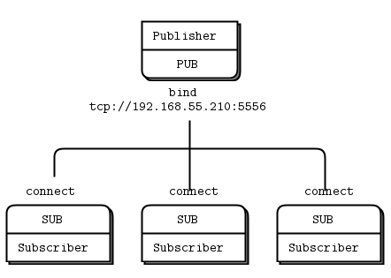

# A beginner's guide to ZeroMQ 

Note: This is my own cheat sheet guide to learning ZeroMQ. I have picked out key examples and concepts necessary for a beginner to grasp from [ZeroMQ official guide](http://zguide.ZeroMQ.org/page:all) and [Learning ØMQ with pyzmq](https://learning-0mq-with-pyzmq.readthedocs.io/en/latest/). All the source code included here are in python3. 
---
[Korean](/easy_zmq_ko.md) [English](/easy_zmq2.md)

###### Table of Contents
------
[Exclusive PAIR Pattern](#Exclusive PAIR Pattern)  
[Request/Reply Pattern](#REQREP)  
[Publish/Subscribe Pattern](#PUBSUB)  
[Push/Pull Pattern](#PUSHPULL)  

---

## 4가지 주요 메시지 패턴
ZeroMQ에는 4가지 주요 메시자 패턴이 있습니다.


### Exclusive PAIR Pattern
---
Exclusive PAIR Pattern 에서는 client와 server가 1:1 관계로, 서로를 상대로만 통신 가능. `client`는 여러개의 `server`와 네트워킹을 할수가 없고, `server`는 여러개의 `client`와 통신을 할 수 가 없습니다. 다만, client-sever pair 사이에서는 `response` 상관 없이, 연속으로 메시지가 가능하며 이부분은 아래 예제 코드를 통해서 확인 할 수 있습니다.

아래 `Exclusive PAIR Pattern` 코드에서 `client` 가 1초마다 메시지를 2번 송신하고, response에 상관없이 `server`는 1초마다 메시지를 송신합니다.

```python
# client.py
import zmq
import random
import sys
import time

port = "5556"
context = zmq.Context() # zmq 통신 할 수 있는 환경 생성
socket = context.socket(zmq.PAIR) # Context안에서 통신 할 수 있는 Socket 생성 
socket.connect("tcp://localhost:%s" % port)

while True:
    msg = socket.recv()
    print(msg)
    socket.send_string("client message to server1") 
    socket.send_string("client message to server2") # 연이어 메시지 2개 송신 가능 
    # sending multiple messages allowed in PAIR pattern
    time.sleep(1)


# server.py
import zmq
import random
import sys
import time

port = "5556"
context = zmq.Context()
socket = context.socket(zmq.PAIR)
socket.bind("tcp://*:%s" % port)

while True:
    socket.send_string("Server message to client3")
    msg = socket.recv()
    print(msg)
    time.sleep(1)
```

<a name="REQREP">Request/Reply Pattern</a>
---
**Request/Reply pattern** 에서는 client가 `request`를 보내고 server가 `request`에 대한 `reply`를 하는 패턴입니다. 이 둘의 관계는 순차적이여서 client 가 `request`를 보낸 경우에만 `server`에서 `reply`를 하고, 마찬가지로 `client` 또한 `server`의 `reply`를 수신하지 않은 경우에는 메시지 `send`를 하지 않습니다. 

**Exclusive PAIR Pattern** 과 다르게 `client`는 여러개의 `server`와 통신이 가능하고, `server` 또한, 여러개의 `client`와 통신이 가능합니다.

일반적으로, 통신에서 `bind()`를 하는 노드가 "server"이고, `connect()` 를 하는 노드가 "client" 입니다. 

아래 예제가 client가 여러 server와 통신을 하는 모습을 보여줍니다.  

Client는 Server가 연결된 포트 5000과 6000에 request를 보냅니다.

```python
# client.py

import zmq
import sys

port = "5000" # default port 
if len(sys.argv) > 1:
    port =  sys.argv[1]  
    int(port)

if len(sys.argv) > 2:
    port1 =  sys.argv[2] # argv 이용하여 default port 외 Input으로 입력된 port 연결 가능
    int(port1)


context = zmq.Context()
print("Connecting to server...")
socket = context.socket(zmq.REQ) # REQ socket 열기 
socket.connect ("tcp://localhost:%s" % port)
if len(sys.argv) > 2: # enables client to send reply to one after another
    socket.connect ("tcp://localhost:%s" % port1)


while True: 
    socket.send_string ("What can I get for you?")
    message = socket.recv()
    print("CUSTOMER: ", message)

```

Server1 is binded to port 5000
```python
# server.py

import zmq
import time
import sys

port = "5000"

context = zmq.Context() 
socket = context.socket(zmq.REP) # create a Server socket 
socket.bind("tcp://*:%s" % port) # bind the Server to a port 

while True:
    message = socket.recv() #  Wait for next request from client
    print("Received request: ", message)
    time.sleep (1)  
    socket.send_string("%s need some coffee" % port) # server1 responds with coffee
```

Server2는 port 6000에 bind 되어 있습니다. 
```python
# server2.py

import zmq
import time
import sys

port = "6000"

context = zmq.Context() 
socket = context.socket(zmq.REP) # create a Server socket 
socket.bind("tcp://*:%s" % port) # bind the Server to a port 

while True:
    message = socket.recv() #  Wait for next request from client
    print("Received request: ", message)
    time.sleep (1)  
    socket.send_string("%s need some hot chocolate" % port) # server2 responds with hot chocolate
```


* Executing the scripts by running the following commands:  
```
python server1.py  
python server2.py  
python client.py 5000 6000   
```

* Output from running `python client.py 5000 6000`
```
Connecting to server...
CUSTOMER:  b'5000 need some coffee'
CUSTOMER:  b'6000 need some hot chocolate'
CUSTOMER:  b'5000 need some coffee'
CUSTOMER:  b'6000 need some hot chocolate'
CUSTOMER:  b'5000 need some coffee'
CUSTOMER:  b'6000 need some hot chocolate'
...
```

<a name="PUBSUB">Publish/Subscribe Pattern</a>

Publish/Subscribe Pattern은 특정 receiver를 겨냥하고 메시지를 보내지 않고 broadcast(방송) 형식으로 메시지를 전송하는 방식입니다. Publisher의 메시지를 받는 쪽을 subscribers 라고 합니다. 

Publisher는 상대방이 존재하는지에 대한 정보는 모른체 메시지를 보내고, subscriber가 알아서 메시지를 듣고, 필터링 하고, 메시지 송신을 멈춥니다.

아래 예제는 하나의 *subscriber* 가 여러개의 *publisher*와 통신하는 코드입니다. 

```python
# pub_server.py

import zmq
import random
import sys
import time

port = "5556"
if len(sys.argv) > 1:
    port =  sys.argv[1]
    int(port)

context = zmq.Context()
socket = context.socket(zmq.PUB) 
socket.bind("tcp://*:%s" % port)

while True:
    topic = random.randrange(9999,10005)
    messagedata = random.randrange(1,215) - 80
    print("%d %d" % (topic, messagedata))
    socket.send_string("%d %d" % (topic, messagedata))
    time.sleep(1)
```

아래와 같이 subscriber는 여러개의 publishers 와 통신할 수 있습니다. 

```python
# sub_client.py

import sys
import zmq

port = "5556"
if len(sys.argv) > 1:
    port =  sys.argv[1]
    int(port)
    
if len(sys.argv) > 2:
    port1 =  sys.argv[2]
    int(port1)

# Socket to talk to server
context = zmq.Context()
socket = context.socket(zmq.SUB)

print("Collecting updates from weather server...")
socket.connect ("tcp://localhost:%s" % port)

if len(sys.argv) > 2:
    socket.connect ("tcp://localhost:%s" % port1)

# Subscribe to zipcode, default is NYC, 10001
topicfilter = "10001"
socket.setsockopt_string(zmq.SUBSCRIBE, topicfilter) # 메시지 필터링 

# Process 5 updates
# Subscriber exits at a point where the publisher publishes "10001" five times
total_value = 0
for update_nbr in range (5):
    string = socket.recv()
    topic, messagedata = string.split()
    total_value += int(messagedata)
    print(topic, messagedata)

print("Average messagedata value for topic '%s' was %dF" % (topicfilter, total_value / update_nbr))

```

* Execute as below
python sub_client.py 5556 6000
python pub_server.py 5556
python pub_server.py 6000

* Output 

from pub_server.py 
```
inside pub_server 10003 70
inside pub_server 10000 56
inside pub_server 10002 -3
inside pub_server 10004 2
inside pub_server 10003 53
inside pub_server 10002 87
inside pub_server 10002 -18
inside pub_server 9999 103
inside pub_server 10000 -31
inside pub_server 10001 -61
inside pub_server 10004 35
inside pub_server 10001 84
inside pub_server 9999 -61
inside pub_server 10002 -79
inside pub_server 10001 -52
inside pub_server 10001 23
inside pub_server 10004 101
inside pub_server 10003 104
inside pub_server 10002 22
inside pub_server 10003 -6
inside pub_server 9999 1
inside pub_server 10001 73
inside pub_server 10004 -27
```

from sub_client.py 
``` 
Collecting updates from weather server...
-- update nbr -- 0
b'10001' b'-61'
-- update nbr -- 1
b'10001' b'84'
-- update nbr -- 2
b'10001' b'-52'
-- update nbr -- 3
b'10001' b'23'
-- update nbr -- 4
b'10001' b'73'
```

반대로, 여러 subscribers가 publisher의 메시지를 듣고 있을 수 있습니다. 




```python
# pub_server.py

import zmq
import random
import sys
import time

port = "5556"
if len(sys.argv) > 1:
    port =  sys.argv[1]
    int(port)

context = zmq.Context()
socket = context.socket(zmq.PUB)
socket.bind("tcp://*:%s" % port)

while True:
    topic = random.randrange(9999,10005)
    messagedata = random.randrange(1,215) - 80
    print("%d %d" % (topic, messagedata))
    socket.send_string("%d %d" % (topic, messagedata))
    time.sleep(1)
```

2개의 *subscribers*는 *pub_server*가 보내는 메시지를 동일하게 받습니다. 
다만, `sub_client1.py` 는 topic filter가 "10001"인 데이터만 받도록 지정하였고, while `sub_client2.py`는 topic filter "10000"인 데이터만 송신하도록 하였습니다. 

```python
# sub_client1.py

import sys
import zmq

port = "5556"
if len(sys.argv) > 1:
    port =  sys.argv[1]
    int(port)
    
context = zmq.Context()
socket = context.socket(zmq.SUB)

print("Collecting updates from weather server...")
socket.connect ("tcp://localhost:%s" % port)

# topicfilter가 10001으로 지정 
topicfilter = "10001"
socket.setsockopt_string(zmq.SUBSCRIBE, topicfilter)

# Process 5 updates
total_value = 0
for update_nbr in range (5):
    string = socket.recv()
    topic, messagedata = string.split()
    total_value += int(messagedata)
    print(topic, messagedata)

print("Average messagedata value for topic '%s' was %dF" % (topicfilter, total_value / update_nbr))

```

Second subscriber has topic filter set at "10001" 
```python
# sub_client2.py

import sys
import zmq

port = "5556"
if len(sys.argv) > 1:
    port =  sys.argv[1]
    int(port)
    
context = zmq.Context()
socket = context.socket(zmq.SUB)

print("Collecting updates from weather server...")
socket.connect ("tcp://localhost:%s" % port)

# topicfilter가 10000으로 지정 
topicfilter = "10000" # different filter!!!
socket.setsockopt_string(zmq.SUBSCRIBE, topicfilter)

# Process 5 updates
total_value = 0
for update_nbr in range (5):
    string = socket.recv()
    topic, messagedata = string.split()
    total_value += int(messagedata)
    print(topic, messagedata)

print("Average messagedata value for topic '%s' was %dF" % (topicfilter, total_value / update_nbr))

```

execute as such: 
```
python pub_server.py 5556 5546
python sub_client.py 5556
python sub_client.py 5546
```

<a name="PUSHPULL">Push/Pull Pattern</a>


Push/Pull Pattern은 메시지를 여러 worker에게 위와 같이 pipeline을 형태로 보내는 형태입니다. 
Push socket이 worker에게 메시지를 전송하고, worker는 최종 recipient에게 메시지를 전송하는 flow입니다. 

*Producer* 는 consumer에게 메시지를 Push 합니다. 

```python
# producer.py 

import time
import zmq

def producer():
    context = zmq.Context()
    zmq_socket = context.socket(zmq.PUSH)
    zmq_socket.bind("tcp://127.0.0.1:5557")

    # 2만번 메시지를 work_message함 
    for num in range(20000):
        work_message = { 'num' : num }
        zmq_socket.send_json(work_message)

producer()

```

*Consumer* (worker)는 먼저 1) producer로 부터 온 메시지를 Pull하고, 2) 받은 메시지를 result collector 에게 push 방법으로 전송합니다. 

```
# consumer.py

import time
import zmq
import random

def consumer():
    consumer_id = random.randrange(1,10005)
    print("I am consumer #%s" % (consumer_id))
    context = zmq.Context()

    # PULL from producer
    consumer_receiver = context.socket(zmq.PULL)
    consumer_receiver.connect("tcp://127.0.0.1:5557")

    # PUSH to result collector
    consumer_sender = context.socket(zmq.PUSH)
    consumer_sender.connect("tcp://127.0.0.1:5558")
    
    while True:
        work = consumer_receiver.recv_json()
        data = work['num']
        result = { 'consumer' : consumer_id, 'num' : data}
        if data%2 == 0: 
            consumer_sender.send_json(result)

consumer()

```


Result collector는 worker로 부터 메시지를 전송받습니다.

```
# resultcollector.py

import time
import zmq
import pprint

def result_collector():
    context = zmq.Context()
    results_receiver = context.socket(zmq.PULL)
    results_receiver.bind("tcp://127.0.0.1:5558")
    collecter_data = {}

    # 1000번째까지만 메시지를 PULL함 
    for x in xrange(1000):
        result = results_receiver.recv_json()
        if result['consumer'] in collecter_data:
            collecter_data[result['consumer']] = collecter_data[result['consumer']] + 1
        else:
            collecter_data[result['consumer']] = 1
        if x == 999:
            pprint.pprint(collecter_data)

result_collector()
```

* code execution in this order:
```
python resultcollector.py
python consumer.py 
python consumer.py
python producer.py
```


* output
python consumer1.py
```
I am consumer #824
```

python consumer1.py
```
I am consumer #567
```

python resultcollector.py
```
{824: 433, 9053: 567}
```

---

# 응용 

지금까지 리뷰한 네가지 메시지 패턴을 조금 응용한 케이스를 살펴보도록 하겠습니다.   


1. 브로커를 이용한 Request-Reply Pattern


다수의 clients가 다수의 servers와 통신을 할때, broker를 이용하면 좀더 scalable하게 코드 구현을 할 수가 있습니다. broker를 이용하여 client와 server가 서로 보지 않아도 client 부분과 server 부분을 연결할 수 있습니다.

`zmq_poll()`를 이용하여 각각의 socket에서 일어나는 activity를 모니터링 하고 양방향으로 메시지를 전송 할 수 가 있습니다. 


`Client` request를 전송합니다. 

```python
# client.py

import zmq

# Prepare our context and sockets
context = zmq.Context()
socket = context.socket(zmq.REQ)
socket.connect("tcp://localhost:5559")

# request 를 보내고 response를 기다는 것을 10번 반복
for request in range(1,11):
    socket.send(b"Hello")
    message = socket.recv()
    print("Received reply %s [%s]" % (request, message))
```

`Server` 는 `bind`가 아닌 broker에 `connect` 

```python
# server.py

import zmq

context = zmq.Context()
socket = context.socket(zmq.REP)
socket.connect("tcp://localhost:5560") # Note Server is connected to port 5560 

while True:
    message = socket.recv()
    print("Received request: %s" % message)
    socket.send(b"World")
```

broker는 client와 server에 각각 `binds` 

```python
# broker.py

import zmq

# Prepare our context and sockets
context = zmq.Context()
frontend = context.socket(zmq.ROUTER)
backend = context.socket(zmq.DEALER)
frontend.bind("tcp://*:5559") # bind to REQ
backend.bind("tcp://*:5560") # bind to REP

# Initialize poll set
poller = zmq.Poller()
poller.register(frontend, zmq.POLLIN) 
poller.register(backend, zmq.POLLIN)

# Switch messages between sockets
while True:
    socks = dict(poller.poll()) 
    # 양쪽 endpoint 로 부터 메시지를 동시에 읽을수가 있음

    if socks.get(frontend) == zmq.POLLIN: 
        # 받은 메시지가 client부터 전송 된 것이면 backend로 송신 
        message = frontend.recv_multipart()
        print("message from frontend", mesasge)
        backend.send_multipart(message)

    if socks.get(backend) == zmq.POLLIN: 
        # 받은 메시지가 server로부터 전송 된 것이면 frontend로 송신 
        message = backend.recv_multipart()
        print("message from backend", mesasge)
        frontend.send_multipart(message)
```

* Output

from broker.py
```
msg from frontend [b'\x00k\x8bEg', b'', b'Hello']
msg from backend [b'\x00k\x8bEg', b'', b'World']
msg from frontend [b'\x00k\x8bEg', b'', b'Hello']
msg from backend [b'\x00k\x8bEg', b'', b'World']
msg from frontend [b'\x00k\x8bEg', b'', b'Hello']
msg from backend [b'\x00k\x8bEg', b'', b'World']
msg from frontend [b'\x00k\x8bEg', b'', b'Hello']
msg from backend [b'\x00k\x8bEg', b'', b'World']
msg from frontend [b'\x00k\x8bEg', b'', b'Hello']
msg from backend [b'\x00k\x8bEg', b'', b'World']
msg from frontend [b'\x00k\x8bEg', b'', b'Hello']
msg from backend [b'\x00k\x8bEg', b'', b'World']
msg from frontend [b'\x00k\x8bEg', b'', b'Hello']
msg from backend [b'\x00k\x8bEg', b'', b'World']
msg from frontend [b'\x00k\x8bEg', b'', b'Hello']
msg from backend [b'\x00k\x8bEg', b'', b'World']
msg from frontend [b'\x00k\x8bEg', b'', b'Hello']
msg from backend [b'\x00k\x8bEg', b'', b'World']
msg from frontend [b'\x00k\x8bEg', b'', b'Hello']
msg from backend [b'\x00k\x8bEg', b'', b'World']
```

from client.py
```
Received reply 1 [b'World']
Received reply 2 [b'World']
Received reply 3 [b'World']
Received reply 4 [b'World']
Received reply 5 [b'World']
Received reply 6 [b'World']
Received reply 7 [b'World']
Received reply 8 [b'World']
Received reply 9 [b'World']
Received reply 10 [b'World']
```


2. Push/Pull Pattern을 이용한 Parallel Pipeline


Parallel Pipeline은 worker가 task를 parallel (수평) 형태로 처리하는 방법입니다. 
*Ventilator*는 먼저 task를 *workers*에게 Push 하고, *Workers* 는 task를 처리하고 결과를 *Sink*에게 보내줍니다. 

또한, task processing이 끝나면, worker를 kill하는 부분도 살펴 보겠습니다. *Sink*는 *worker* 의 모든 task가 끝난 시점을 파악하여 PUB socket을 이용하여 메시지를 전송합니다. 


아래 코드에서 *Ventilator*는 PUSH socket을 만들어서 port 5558에 `bind`합니다.  

```python
# ventilator.py

import zmq
import random
import time

try:
    raw_input
except NameError:
    # Python 3
    raw_input = input

context = zmq.Context()

# Worker로 메시지를 보내기 위한 Push Socket 
sender = context.socket(zmq.PUSH)
sender.bind("tcp://*:5557")

# Sink로 메시지 시작점을 알리기 위한 Push Socket 
sink = context.socket(zmq.PUSH)
sink.connect("tcp://localhost:5558")

print("Press Enter when the workers are ready: ")
_ = raw_input()
print("Sending tasks to workers…")

# The first message is "0" and signals start of batch
sink.send(b'0')

# Initialize random number generator
random.seed()

# 100개의 task를 전송 
total_msec = 0
for task_nbr in range(100):

    # workload의 양은 1 부터 100 중 랜덤으로 선택 
    workload = random.randint(1, 100)
    total_msec += workload

    sender.send_string(u'%i' % workload)

print("Total expected cost: %s msec" % total_msec)

# Give 0MQ time to deliver
time.sleep(1)
```

*Worker* 는 task를 pull 한후 Sink 에게 다시 전송합니다. 

```python
# worker.py

import sys
import time
import zmq

context = zmq.Context()

# Ventilator로 부터 메시지를 받기 위한 Pull Socket 
receiver = context.socket(zmq.PULL)
receiver.connect("tcp://localhost:5557")

# Sink에게 메시지 보내기 위한 PUSH Socket 
sender = context.socket(zmq.PUSH)
sender.connect("tcp://localhost:5558")

# Worker Kill time을 알기 위한 SUB Socket 
controller = context.socket(zmq.SUB)
controller.connect("tcp://localhost:5559")
controller.setsockopt(zmq.SUBSCRIBE, b"") # filter out messages

# 송신 받는 두가지 타입의 메시지 (receiver와 controller) 관리 
poller = zmq.Poller()
poller.register(receiver, zmq.POLLIN)
poller.register(controller, zmq.POLLIN)

# PULL Socket과 SUB Socket에서의 메시지 둘다 관리 
while True:
    socks = dict(poller.poll())

    if socks.get(receiver) == zmq.POLLIN: # Ventilator로 부터 PULL받은 메시지인 경우 
        message = receiver.recv_string()

        # Process task
        workload = int(message) 

        # Do the work
        time.sleep(workload / 1000.0)

        # Send results to sink
        sender.send_string(message) # Sink로 메시지 PUSH 

        # Simple progress indicator for the viewer
        sys.stdout.write(".")
        sys.stdout.flush()

    # Controller가 메시지를 전송 받은 경우, 'kill'로 해석하고 exit 
    if socks.get(controller) == zmq.POLLIN:
        break

# Finished
receiver.close()
sender.close()
controller.close()
context.term()
```

*sink* 에서는 언제 *worker*에게 'kill' 메시지를 전송할지 결정합니다.

```python
# sink.py

import sys
import time
import zmq

context = zmq.Context()

# *Worker*로부터 메시지 받기 위한 PULL Socket 
receiver = context.socket(zmq.PULL)
receiver.bind("tcp://*:5558")

# *Worker*에게 메시지 Publish 하기 위한 PUB Socket
controller = context.socket(zmq.PUB)
controller.bind("tcp://*:5559")

# Wait for start of batch
receiver.recv()

# Start our clock now
tstart = time.time()

# Process 100 confirmiations
for task_nbr in range(100):
    receiver.recv()
    if task_nbr % 10 == 0:
        sys.stdout.write(":")
    else:
        sys.stdout.write(".")
    sys.stdout.flush()

# Calculate and report duration of batch
tend = time.time()
tdiff = tend - tstart
total_msec = tdiff * 1000
print("Total elapsed time: %d msec" % total_msec)

# Send kill signal to workers
controller.send(b"KILL")

# Finished
receiver.close()
controller.close()
context.term() # terminate
```


3. Request-Reply pattern 이용한 Reliable networking

Reliable networking 이란 코드가 break하거나 잘 돌아가지 않는 상황에도 네크워킹이 유지 될 수 있도록 하는 것입니다. 예를들면, Server에 장애가 생기면, Client가 서버에 문제가 생긴 걸 알고 기다리거나 다시 connection을 시도 하는 등 다른 방법을 시도 할 수 있게 하는 것입니다. 

방법은 여러 방법이 있지만 먼저 *1. brute force*(lazy pirate pattern) 를 이용할수 있습니다. 

아래 예제 코드는 Client가 REQ 에러를 encounter 한 후, REQ socket을 다시 닫고 열어보는 방법을 구현 한 것 입니다. 총 3번 까지 시도를 하고 그 이후에도 서버 에러가 있는 경우에는 프로세스가 terminate됩니다. 

```python
# client.py

from __future__ import print_function

import zmq

REQUEST_TIMEOUT = 2500
REQUEST_RETRIES = 3 # 3번의 retry 기회 
SERVER_ENDPOINT = "tcp://localhost:5555"

context = zmq.Context(1)

print("I: Connecting to server…")
client = context.socket(zmq.REQ)
client.connect(SERVER_ENDPOINT)

# initialize poller
poll = zmq.Poller()
poll.register(client, zmq.POLLIN)

sequence = 0
retries_left = REQUEST_RETRIES
while retries_left:
    sequence += 1
    request = str(sequence).encode()
    print("I: Sending (%s)" % request)
    client.send(request)

    expect_reply = True
    while expect_reply:
        socks = dict(poll.poll(REQUEST_TIMEOUT)) 
        # resend a request if no reply has arrived within a timedout period
        if socks.get(client) == zmq.POLLIN:
            reply = client.recv()
            if not reply:
                break
            if int(reply) == sequence:
                print("I: Server replied OK (%s)" % reply)
                retries_left = REQUEST_RETRIES
                expect_reply = False
            else:
                print("E: Malformed reply from server: %s" % reply)

        else:
            print("W: No response from server, retrying…")
            # Socket is confused. Close and remove it.
            client.setsockopt(zmq.LINGER, 0)
            client.close()
            poll.unregister(client)
            retries_left -= 1
            if retries_left == 0:
                print("E: Server seems to be offline, abandoning") 
                # completely exit the program
                break
            print("I: Reconnecting and resending (%s)" % request)
            # Create new connection
            client = context.socket(zmq.REQ)
            client.connect(SERVER_ENDPOINT)
            poll.register(client, zmq.POLLIN)
            client.send(request)

context.term()

```


```python
# server.py

from __future__ import print_function

from random import randint
import time
import zmq

context = zmq.Context(1)
server = context.socket(zmq.REP)
server.bind("tcp://*:5555")

cycles = 0
while True:
    request = server.recv()
    cycles += 1

    # Simulate various problems, after a few cycles
    if cycles > 3 and randint(0, 3) == 0:
        print("I: Simulating a crash")
        break
    elif cycles > 3 and randint(0, 3) == 0:
        print("I: Simulating CPU overload")
        time.sleep(2)

    print("I: Normal request (%s)" % request)
    time.sleep(1) # Do some heavy work
    server.send(request)

server.close()
context.term()

```

* output from 
server 
```

I: Normal request (b'1')
I: Normal request (b'1')
I: Normal request (b'2')
I: Normal request (b'3')
I: Normal request (b'4')
I: Simulating a crash

```

client 
```
I: Connecting to server…
I: Sending (b'1')
W: No response from server, retrying…
I: Reconnecting and resending (b'1')
W: No response from server, retrying…
I: Reconnecting and resending (b'1')
I: Server replied OK (b'1')
I: Sending (b'2')
I: Server replied OK (b'2')
I: Sending (b'3')
I: Server replied OK (b'3')
I: Sending (b'4')
I: Server replied OK (b'4')
I: Sending (b'5')
W: No response from server, retrying…
I: Reconnecting and resending (b'5')
W: No response from server, retrying…
I: Reconnecting and resending (b'5')
W: No response from server, retrying…
E: Server seems to be offline, abandoning
```

brute-force의 장점은 비교적 구현하기 쉽다는 장점이 있고, ZeroMQ가 자동적으로 reconnection을 시도하지만, 다른 유효한 Server로 이동하거나, 다른 백업 방안을 강구하지는 않는 단점이 있습니다.
다른 방안으로는, 2. Basic Reliable Queuing (Simple Pirate Pattern), 3. Paranoid Reliable Queuing (Paranoid Pirate Pattern) 등 이 있습니다. 


